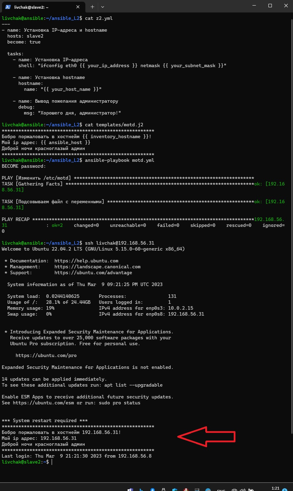
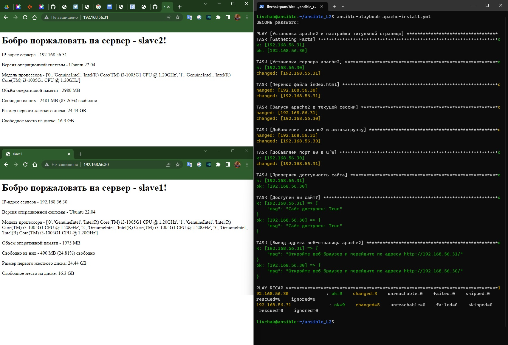
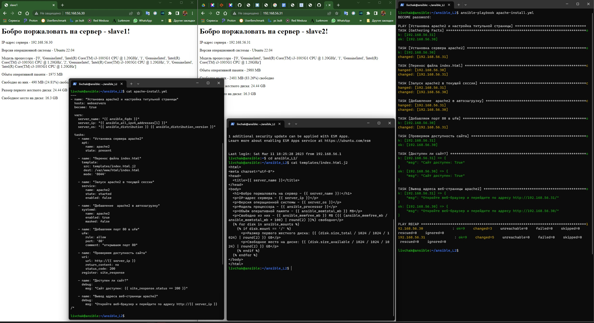

# Домашнее задание к занятию "`7-22hw`" - `Ливчак Сергей`

Сыылки на конфиг 
[ansible.cfg](ansible-config-file/ansible.cfg) [Hosts](ansible-config-file/hosts)

### Задание 1

`Напишите три плейбука. При написании рекомендуем использовать текстовый редактор с подсветкой синтаксиса YAML.`

1. `Скачать архив, создать папку для распаковки и распаковать скаченный архив.`

**Скриншот 1-1_1** Задание 1-1

2. `Установить пакет tuned из стандартного репозитория вашей ОС. Запустить его, как демон — конфигурационный файл systemd появится автоматически при установке. Добавить tuned в автозагрузку.`

**Скриншот 1-2_1** Задание 1-2

3. `Изменить приветствие системы (motd) при входе на другое с использование переменных в ansible.`

**Скриншот 1-3_1** Задание 1-3

###

---

### Задание 2

`Модифицируйте плейбук из пункта 3, задания 1. В качестве приветствия он должен установить IP-адрес и hostname управляемого хоста, пожелание хорошего дня системному администратору в выводе motd.`

[Playbook](ansible-config-file/z2.yml) [j2](ansible-config-file/motd.j2)

**Скриншот 2-1_1** содержимое плейбука и вывод

дополнительный вывод информации

**Скриншот 2-1_1+** содержимое плейбука и вывод

### 

---

### Задание 3

`Создайте плейбук, который будет включать в себя одну, созданную вами роль. Роль должна:`

1. `Установить веб-сервер Apache на управляемые хосты.`
2. `Сконфигурировать файл index.html c выводом характеристик для каждого компьютера. Необходимо включить CPU, RAM, величину первого HDD, IP-адрес. Используйте Ansible facts и jinja2-template`
1. `Открыть порт 80, если необходимо, запустить сервер и добавить его в автозагрузку.`
1. `Сделать проверку доступности веб-сайта (ответ 200, модуль uri).`

[Playbook](ansible-config-file/apache-install.yml) [j2](ansible-config-file/index.html.j2)

**Скриншот 3-1-1** вывод исполнения Ansible + вывод страничек 

Больше содержимого в одном скриншоте

**Скриншот 3-1-1+** вывод исполнения Ansible + вывод страничек + содержимое yml и j2

---

### 