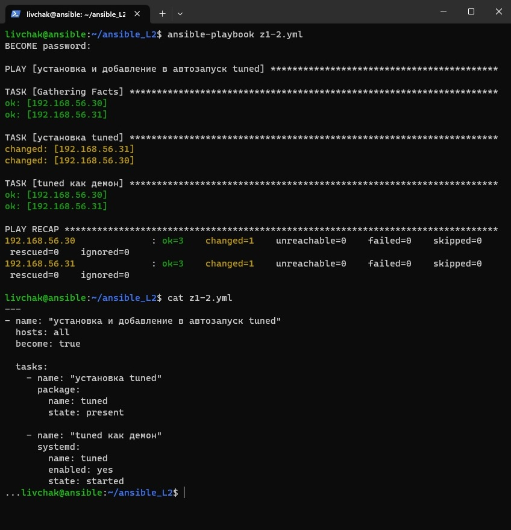

# Домашнее задание к занятию "`7-22hw`" - `Ливчак Сергей`

### Задание 1

`Напишите три плейбука. При написании рекомендуем использовать текстовый редактор с подсветкой синтаксиса YAML.`

1. `Скачать архив, создать папку для распаковки и распаковать скаченный архив.`

**Скриншот 1** Задание 1-1

1. `Установить пакет tuned из стандартного репозитория вашей ОС. Запустить его, как демон — конфигурационный файл systemd появится автоматически при установке. Добавить tuned в автозагрузку.`

**Скриншот 1** Задание 1-2

1. `Изменить приветствие системы (motd) при входе на другое с использование переменных в ansible.`

**Скриншот 1** Задание 1-3

---

### Задание 2*

`Создать алертинг с уведомлением на почту`

1. `Создал алерт на превышение нагрузки процессора `
2. `выше 50 - придёт сообщение "warning"`
3. `выше 80 - придёт сообщение "alarm"`

**Скриншот 2** График аларминга и сообщение на почту

### 